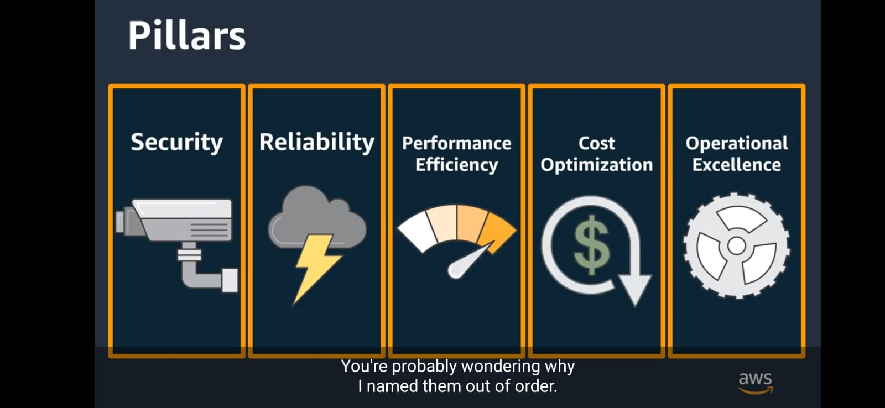

# **Protecting Compute Resources**

## Best Practices EC2 instances

* Restrict access at the network and the OS layer (ACLs)
* Control the API access coming from EC2 instances
* Apply change management and configuration management to monitor and control Amazon EC2 configurations
* Apply security monitoring and auditing for EC2 resources and your accounts (AWS CloudTrail, AWS Config)

## Securing Amazon EC2 Instances
The process for securing EC2 instances involves principles that are applicable to any OS, whether running in a virtual machine or on premises:

* **Least Access**: Restrict server access from both the network and on the instance, install only the required OS components and applications, and leverage host-based protection software.
* **Least Privilege**: Define the minimum set of privileges each server needs in order to perform its function.
Configuration Management: Create a baseline server configuration and track each server as a configuration item. Assess each server against the current recorded baseline to identify and flag any deviations. Ensure each server is configured to generate and securely store appropriate log and audit data.
* **Change Management**: Create processes to control changes to server configuration baselines.
Audit Logs: Audit access and all changes to EC2 instances to verify server integrity to ensure only authorized changes are made.

For more information on securing EC2 instances please see: https://aws.amazon.com/answers/security/aws-securing-ec2-instances/

## Docker Services

* Amazon Elastic Container Service (ECS)
* Amazon Elastic Kubernetes Service (EKS)
* AWS Fargate
* AWS Elastic Beanstalk

**Amazon Elastic Container Service (Amazon ECS)**

Amazon ECS allows you to specify an IAM role for each ECS task. This allows the Amazon ECS container instances to have a minimal role, respecting the ‘least privilege’ access policy and allowing you to manage the instance role and the task role separately. You can also use Amazon CloudWatch Logs to gain visibility into the IAM role to which a task is assigned.  More details on Amazon ECS can be found at: https://aws.amazon.com/ecs/features/

## AWS Lambda
AWS Manages everything but the code. (Can use AWS CloudWatch, CloudTrail, Config)

We have to take care of:

* Security of your code
* Storage and accessbility of sensitive data
* IAM to the Lambda service and within your function

This white paper provides an overview of security when using Lambda: https://d1.awsstatic.com/whitepapers/Overview-AWS-Lambda-Security.pdf

## **Securing endpoints**

[VIDEO](https://coursera.org/share/b576a597e4b71d0f9d4d69d8918d6317)

## Elastic Load Balancing (ELB)
Elastic Load Balancing works with Amazon Virtual Private Cloud (VPC) to provide robust security features, including integrated certificate management, user-authentication, and SSL/TLS decryption. Together, they give you the flexibility to centrally manage TLS settings and offload CPU intensive workloads from your applications.  For more information on ELB, see https://aws.amazon.com/elasticloadbalancing/ 

Additional information about TLS termination for Network Load balancers is available in this AWS Blog posting: https://aws.amazon.com/blogs/aws/new-tls-termination-for-network-load-balancers/

## Amazon API Gateway
Amazon API Gateway is a fully managed service that makes it easy for developers to create, publish, maintain, monitor, and secure APIs at any scale. With a few clicks in the AWS Management Console, you can create REST and WebSocket APIs that act as a “front door” for applications to access data, business logic, or functionality from your backend services, such as workloads running on Amazon Elastic Compute Cloud (Amazon EC2), code running on AWS Lambda, any web application, or real-time communication applications.  Information about Amazon API Gateway can be found at: https://aws.amazon.com/api-gateway/

## AWS Shield
AWS Shield is a managed Distributed Denial of Service (DDoS) protection service that safeguards applications running on AWS. AWS Shield provides always-on detection and automatic inline mitigations that minimize application downtime and latency, so there is no need to engage AWS Support to benefit from DDoS protection. There are two tiers of AWS Shield - Standard and Advanced.  Details on AWS Shield are available at: https://aws.amazon.com/shield/

## AWS WAF
AWS WAF is a web application firewall that helps protect your web applications from common web exploits that could affect application availability, compromise security, or consume excessive resources. AWS WAF gives you control over which traffic to allow or block to your web applications by defining customizable web security rules. You can use AWS WAF to create custom rules that block common attack patterns, such as SQL injection or cross-site scripting, and rules that are designed for your specific application. New rules can be deployed within minutes, letting you respond quickly to changing traffic patterns. Also, AWS WAF includes a full-featured API that you can use to automate the creation, deployment, and maintenance of web security rules.  Details on AWS WAF are available at: https://aws.amazon.com/waf/

## **Secrets Manager**
AWS Secrets Manager helps you protect secrets needed to access your applications, services, and IT resources. The service enables you to easily rotate, manage, and retrieve database credentials, API keys, and other secrets throughout their lifecycle. Users and applications retrieve secrets with a call to Secrets Manager APIs, eliminating the need to hardcode sensitive information in plain text. Secrets Manager offers secret rotation with built-in integration for Amazon RDS, Amazon Redshift, and Amazon DocumentDB. Also, the service is extensible to other types of secrets, including API keys and OAuth tokens. In addition, Secrets Manager enables you to control access to secrets using fine-grained permissions and audit secret rotation centrally for resources in the AWS Cloud, third-party services, and on-premises.  More details on AWS Secrets Manager is available at: https://aws.amazon.com/secrets-manager/

## **AWS Well-Architected**
The Well-Architected Framework has been developed to help cloud architects build secure, high-performing, resilient, and efficient infrastructure for their applications. Based on five pillars — operational excellence, security, reliability, performance efficiency, and cost optimization — the Framework provides a consistent approach for customers and partners to evaluate architectures, and implement designs that will scale over time.

The AWS Well-Architected Tool is now available.

